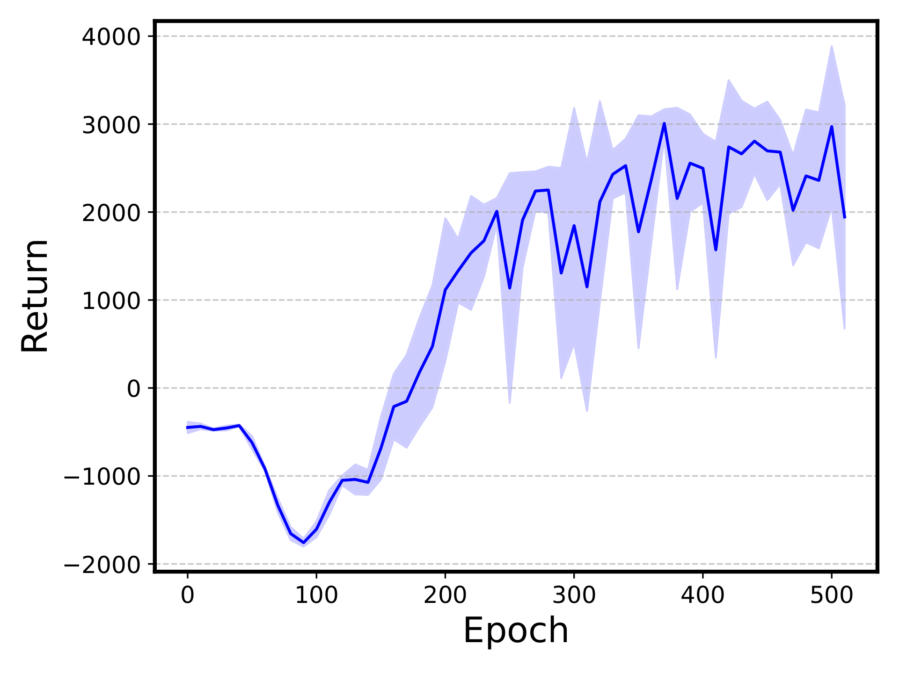
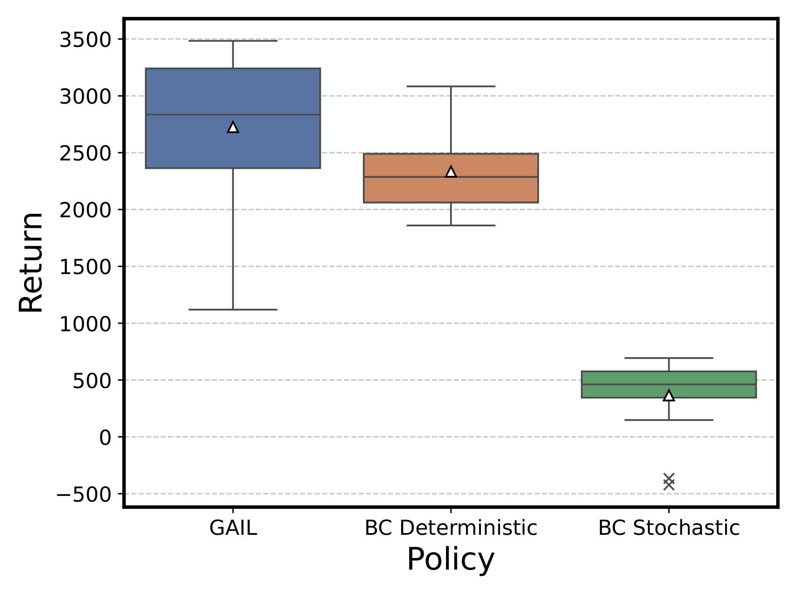

# GAIL Project by Group 23 (CS8803-DRL, Spring '25)

| Name        | GT ID      | Email                  |
|-------------|------------|------------------------|
| Uzair Akbar | 903716606  | uzair.akbar@gatech.edu |
| Yipu Chen   | 903591874  | yipuchen@gatech.edu    |
| Jaehwi Jang | 903840678  | jjang318@gatech.edu    |
| Yitong Li   | 903537230  | yli3277@gatech.edu     |
| Ziwon Yoon  | 903934417  | zyoon6@gatech.edu      |

## Artifacts

https://github.com/user-attachments/assets/23c254a8-a54d-428d-9b27-b3d871db6589

| Reward graph during training    | Evaluaiton against baselines    |
| :---------------------: | :------------------------------------: |
|  |  |

## Setup
Clone this repository.
```bash
git clone https://github.com/uzairakbar/drl-project.git
```

### Mujoco
Follow the instructions [here](https://github.com/openai/mujoco-py?tab=readme-ov-file#install-mujoco) to install mujoco.

### Dataset
If running locally, you will need to download the expert dataset.

First install `wget` if not installed.
```bash
brew install wget           # in MacOS
sudo apt-get install wget   # in Ubuntu/Linux
```
Then download expert data with the following.
```bash
dataset_path='https://github.com/Div99/IQ-Learn/blob/main/iq_learn/experts/HalfCheetah-v2_25.pkl?raw=true'
wget "$dataset_path" -O HalfCheetah-v2_25.pkl
```

### Environment
#### Google colab (recommended)
You can also simply try our notebook on [google colab](https://colab.research.google.com/drive/19Qi_-Uzw4efC5ORLATTzGSYd_8hTI2jI?usp=sharing).

#### Conda environment
Install dependencies with `conda`.
```bash
conda env create -f environment.yaml
conda activate gail
export PYTORCH_ENABLE_MPS_FALLBACK=1
```
Then run the jupyter notebook `gail.ipynb` by setting the kernel/interpreter as the environment `gail`.

#### Python `venv`
Setup the python virtual environemnt (requires python `3.10.14`).
```bash
python -m venv .env
source .env/bin/activate
pip install -r requirements.txt
export PYTORCH_ENABLE_MPS_FALLBACK=1
```
Then run the jupyter notebook `gail.ipynb` by setting the kernel/interpreter as this environment.

### Tensorboard
Launch tensorboard as follows.
```bash

```