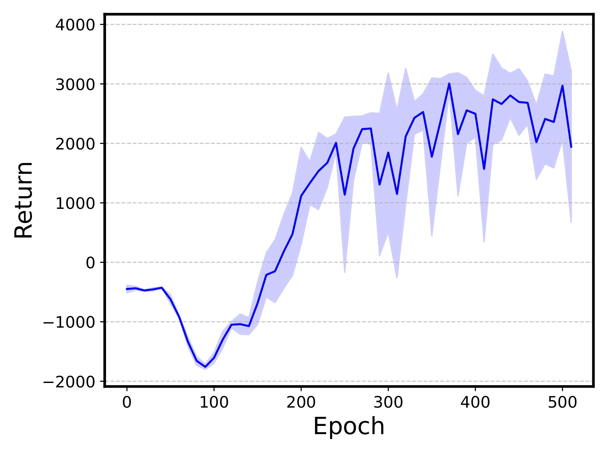
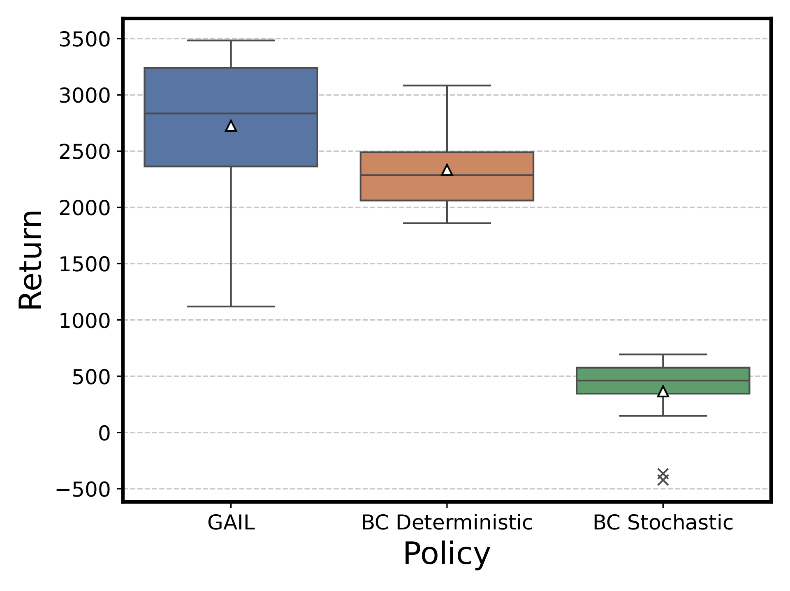
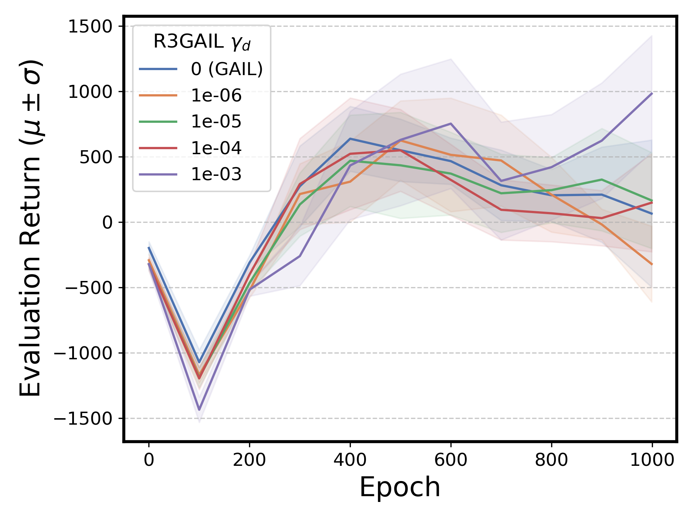

# GAIL Project by Group 23 (CS8803-DRL, Spring '25)

| Name        | GT ID      | Email                  |
|-------------|------------|------------------------|
| Uzair Akbar | 903716606  | uzair.akbar@gatech.edu |
| Yipu Chen   | 903591874  | yipuchen@gatech.edu    |
| Jaehwi Jang | 903840678  | jjang318@gatech.edu    |
| Yitong Li   | 903537230  | yli3277@gatech.edu     |
| Ziwon Yoon  | 903934417  | zyoon6@gatech.edu      |

## Artifacts
The following results were generated for the `HalfCheetah-v5` environment.

https://github.com/user-attachments/assets/74f2d498-17ec-4419-ba41-fb55114b6131

| GAIL training returns    | GAIL Evaluaiton vs. Baselines    | R3GAIL Evaluation vs. GAIL |
| :---------------------: | :------------------------------------: | :---------------------: |
|  |  |  |

## Setup
Clone this repository.
```bash
git clone https://github.com/uzairakbar/drl-project.git
```

### Mujoco
Follow the instructions [here](https://github.com/openai/mujoco-py?tab=readme-ov-file#install-mujoco) to install mujoco.

### Dataset
If running locally, you will need to download the expert dataset.

First install `wget` if not installed.
```bash
brew install wget           # in MacOS
sudo apt-get install wget   # in Ubuntu/Linux
```
Then download expert data with the following.
```bash
dataset_path='https://github.com/Div99/IQ-Learn/blob/main/iq_learn/experts/HalfCheetah-v2_25.pkl?raw=true'
wget "$dataset_path" -O HalfCheetah-v2_25.pkl
```
Or simply use any of the provided datasets under the `expert_data/` directory.

### Environment
#### Conda environment
Install dependencies with `conda`.
```bash
conda env create -f environment.yaml
conda activate gail
export PYTORCH_ENABLE_MPS_FALLBACK=1
```

#### Python `venv`
Setup the python virtual environemnt (requires python `3.10` and above).
```bash
python -m venv .env
source .env/bin/activate
pip install -r requirements.txt
export PYTORCH_ENABLE_MPS_FALLBACK=1
```

### Logging
Please define the `WANDB_ENTITY` environment variable according to your [Weights and Biases](https://wandb.ai/site/) account.
```bash
export WANDB_ENTITY='[YOUR_W&B_ENTITY]'
```

### Usage
Pick one of the given configurations under `configs/` directory. Or specify your desired custom training/evaluation configuration as follows
```yaml
seed: 0
env_name: HalfCheetah-v5
epochs: 1000
gamma: 0.99
n_envs: 64               # NOTE: following 3 fields must be same
n_eval_envs: 64
batch_size: 64
hidden_dim: 64
eval_episodes: 16
gae_lambda: 0.95
ppo_epsilon: 0.2
learning_rate: 0.0004
generator_iterations: 32
discriminator_iterations: 1
algorithm: R3GAIL       # Options: R3GAIL, BC, BC_Stochastic
log_dir: ant_runs
gamma_d: 0.001          # needed for R3GAIL
gamma_g: 0.001          # needed for R3GAIL
```

Then simply run the training script as
```bash
python train.py --config [PATH/TO/CONFIG]
```